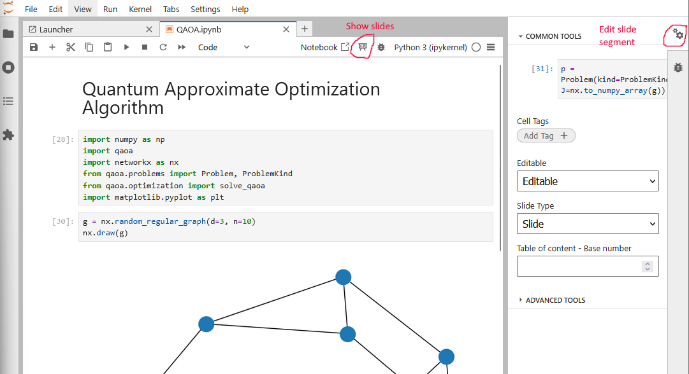

# Ciceron demos

This notebook assumes that we use `uv`, the Python environment manager. If you are in windows, you should firs install `uv`, with something like
```
winget install astral-sh.uv
```
This should be run from a terminal. The terminal closed, and then reopened again to have the command available. For other platforms, please check the official `uv` documentation at https://docs.astral.sh/uv/

Once the manager is installed, you can simply issue
```
uv pip install .
```
This will install all packages that are under the `src` folder. To make sure it worked, you can, for instance
```
uv run python -c "import qaoa"
```
This will fail if the `qaoa` component was not installed. Alternatively, you can also run the tests
```
uv run python -m unittest discover
```

After this preliminary step, the jupyter notebooks should be ready to be launched. Use the following command:
```
uv run jupyter lab examples
```
There should be a presentation icon in the menu bar, and you can edit the slide nature of a cell using the "wheel" icon to the right.

